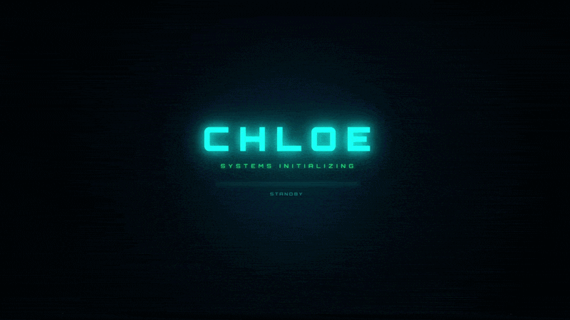
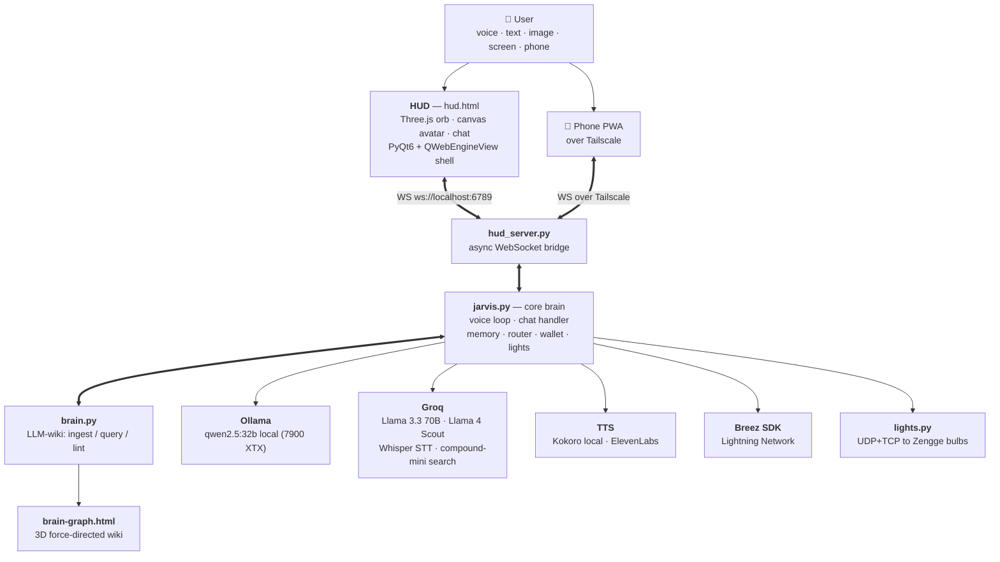

# Chloe — Personal Holographic AI Assistant

> A local-first, multimodal AI assistant with a holographic HUD, a real-time
> voice pipeline, a self-maintained knowledge wiki, a 3D brain-graph
> visualizer, a mobile PWA over Tailscale, smart-home control, and Bitcoin
> Lightning integration. Built end-to-end by Edward Wayne.

[](https://youtu.be/76BGUzwDIIQ)

---

## What Is Chloe?

Chloe is an end-to-end personal AI assistant built for immersive, real-world use.
She runs locally on Windows with a 7900 XTX GPU, listens for a wake word,
understands voice and vision, maintains her own knowledge base, controls smart
bulbs and Lightning payments, and is reachable from a phone over Tailscale —
all through a holographic heads-up display rendered in a native desktop window.

This is not a wrapper around a chatbot API. It is a full real-time system: audio
pipeline, state machine, hybrid local + cloud LLM routing with two-way fallback,
multimodal vision, persistent memory, a Karpathy-style LLM-wiki, financial API
integration, autonomous background loops, and a custom 3D holographic UI —
designed and built from scratch.

---

## Live Demo

> [Watch the 90s demo on YouTube](https://youtu.be/76BGUzwDIIQ) — voice
> loop, screen vision, brain graph, mobile PWA, smart bulbs, and Lightning.

---

## Core Features

### 🎙️ Voice Pipeline
- Wake word detection via OpenWakeWord ("Hey Chloe" / "Chloe")
- Speech-to-text via Groq Whisper (`whisper-large-v3-turbo`)
- Hybrid LLM inference — local `qwen2.5:32b` via Ollama on a 7900 XTX, with
  Groq (`llama-3.3-70b-versatile` and `compound-mini` for search) as cloud
  burst. Fallback in both directions on quota or empty response.
- Text-to-speech via Kokoro local (`af_heart` voice) or ElevenLabs neural
- Per-sentence streaming TTS — orb starts pulsing within ~500ms of generation
  beginning, not after the full reply is buffered
- Full state machine: **Idle → Listening → Thinking → Speaking** with barge-in
- Voice, text, and PTT paths share a unified conversation history

### 🌐 Holographic Interface
- Galaxy orb visualizer built in **Three.js** with custom **GLSL shaders**
- Real-time audio amplitude reactivity — orb and avatar face respond to voice
- Post-processing pipeline: Unreal Bloom, chromatic aberration, scanlines, vignette
- Canvas-rendered animated AI avatar face with lip sync
- WebSocket bridge connecting Python backend to browser-based HUD
- Packaged in a native desktop window via **PyQt6 + QWebEngineView**

### 👁️ Multimodal Vision
- `/see` — describes the screen
- `/ask <question>` — answers questions about the current screen via
  Llama 4 Scout (vision model)
- `/ingest_screen` — captures + adds the screen's content to the brain
- Configurable blocklist (`CHLOE_VISION_BLOCKLIST`) prevents capture of
  password managers, wallets, etc.

### 🧠 Karpathy-Style LLM-Wiki Brain
- `/ingest <file>` — extracts entities + concepts from a source, builds
  wiki pages with TLDR, key points, and grounded descriptions
- `/ingest --dry-run <file>` — preview CREATE vs UPDATE actions before
  anything writes to the brain. Catches hallucinated entities or thin-source
  filler before it pollutes the wiki.
- `/query <question>` — RAG over wiki pages
- `/lint` — finds empty/skeletal/duplicate pages
- Three layers (raw / wiki / schema), source text grounding rules in the
  update prompt, validator that catches preamble-wrapped skip responses

### 🕸️ 3D Brain Graph
- Force-directed three.js graph of every wiki page, glowing cyan orbs
- Click an orb to open a side-panel chat scoped to that page
- Visually striking; demos beautifully
- Served on `http://localhost:6790/brain-graph.html`

### 🤖 Autonomous Loops
- **Daily context generator** at 6am — synthesizes recent activity into
  `CONTEXT-<date>.md`
- **Queue processor** every 2h — runs RESEARCH / SYNTHESIZE / DRAFT /
  ANALYZE verbs against the brain
- **Auto-fact extraction** on every chat turn — captures details Edward
  mentions into `facts.md`

### ⚡ Bitcoin & Lightning Integration
- Send and receive Lightning invoices via **Breez SDK** (Liquid)
- Live wallet balance displayed in the HUD
- Voice-triggered payment flows with PIN guard and per-payment cap
- Voice and chat both gated by the same PIN/cap policy

### 💡 Smart-Bulb Control
- Native UDP discovery + TCP control of Zengge Magic Home WiFi bulbs (no hub)
- Voice ("kitchen warm"), chat (`/lights kitchen warm`), and HUD CH02 panel
- Color, color temperature, brightness, on/off, named groups
- Works around the `flux_led` Windows blocking-write bug

### 📱 Mobile PWA Over Tailscale
- Chloe reachable from phone over the user's private tailnet
- PWA with manifest + service worker — installs like a native app
- Same WebSocket bus the desktop HUD uses; PTT, chat, lights all work
- Network architecture is Tailscale, NOT a port-forward — no public exposure

### 🎭 Persona Depth
- Seven-section persona file (`chloe_about.md`, loaded at runtime —
  gitignored for privacy, ships empty so you can write your own) covers
  voice & speech style, emotional warmth, anti-sycophancy, anchored
  favorites, and knowledge anchors
- qwen2.5:32b follows the persona convincingly — natural prose with
  contractions, commits to one favorite on follow-ups, doesn't cross-
  contaminate character rosters

### 🔍 Web Search
- Real-time search via Groq's `compound-mini` model — server-side tool calls
  handle the search loop end-to-end
- A keyword router heuristic detects time-sensitive queries and routes only
  those to the search-capable model, saving quota for what only it can do
- Router keywords tightened to avoid false positives ("Hans Zimmer score"
  used to route to compound-mini and burn quota — fixed)

---

## Architecture



---

## Tech Stack

| Layer | Technology |
|---|---|
| Local LLM | Ollama — qwen2.5:32b Q4_K_M on 7900 XTX (ROCm) |
| Cloud LLM | Groq — Llama 3.3 70B (text), Llama 4 Scout (vision), compound-mini (search) |
| STT | Groq Whisper large-v3-turbo |
| TTS | Kokoro local (`af_heart`) primary, ElevenLabs neural fallback |
| Streaming TTS | Per-sentence chunked broadcast to HUD |
| Wake Word | OpenWakeWord (ONNX inference) |
| Brain Wiki | Custom Karpathy-style LLM-wiki with dry-run + grounding rules |
| Brain Graph | Three.js force-directed force-graph over wiki pages |
| 3D Visuals | Three.js r160 — custom GLSL vertex + fragment shaders |
| Post-FX | UnrealBloomPass, chromatic aberration, scanline pass |
| Avatar | HTML5 Canvas — procedural face with lip sync |
| Backend | Python — asyncio, websockets, threading |
| Desktop | PyQt6 + QWebEngineView |
| Mobile | PWA over Tailscale (manifest + service worker) |
| Bitcoin | Breez SDK Liquid — Lightning Network send/receive/balance |
| Smart Home | Native flux_led / UDP discovery + TCP control |
| Search | Groq compound-mini with router heuristic |
| Packaging | PyInstaller — standalone .exe, no Python required |
| Transport | WebSocket real-time bidirectional bridge |

---

## Skills Demonstrated

- **Real-time systems** — Latency-sensitive audio pipeline, concurrent voice
  and chat paths in parallel threads, per-sentence streaming TTS so the orb
  pulses within ~500ms of generation
- **Hybrid LLM routing with graceful fallback** — Local-first via Ollama,
  cloud burst via Groq compound-mini for real-time. Both layers resilient:
  Groq exception OR 200-with-empty-content falls to Ollama; Ollama TTL cache
  picks up mid-session restarts
- **Karpathy-style LLM-wiki** — Self-maintained knowledge base with
  ingest/query/lint, source-text grounding rules, dry-run preview, and a
  validator that catches the LLM's own SKIP_PAGE escape hatches
- **Multimodal AI** — Vision toolkit coordinated with the brain layer;
  /ingest_screen captures + ingests in one step
- **API orchestration** — Ollama, Groq, ElevenLabs, OpenWakeWord, Breez SDK,
  flux_led, Tailscale, plus a custom WebSocket bridge, integrated into one
  coherent real-time system
- **Voice pipeline architecture** — Wake word → STT → LLM → TTS chain with
  clean state machine (idle/listening/thinking/speaking) and barge-in
- **WebGL / Shader programming** — Custom GLSL shaders for galaxy orb core,
  plasma shell, audio-reactive pulse waves, full post-processing pipeline
- **3D data visualization** — Force-directed graph of wiki pages with
  click-to-scope chat per node
- **Financial API integration** — Lightning Network payments via Breez SDK
  Liquid, voice-triggered with PIN/cap guard
- **Smart home / IoT** — UDP LAN discovery + TCP control of Zengge bulbs
  with a workaround for the flux_led Windows bug
- **Network architecture** — Mobile PWA reachable over Tailscale, not a
  port-forward
- **Memory system design** — Persistent context, auto-fact extraction,
  daily context generation, queue-processor autonomous loops
- **Persona engineering** — Seven-section persona file with grounding,
  anchors, anti-sycophancy rules, and stress-tested character consistency
- **Desktop application packaging** — PyQt6 native window with embedded
  browser engine; ships as standalone .exe via PyInstaller

---

## Project Structure

```
chloe/
├── start_jarvis.py       # Main launcher — PyQt6 window + starts all services
├── jarvis.py             # Core brain — voice loop, chat, memory, wallet, lights
├── brain.py              # LLM-wiki: ingest, query, lint, dry-run, validator
├── brain_wiring.py       # Heavy-call routing with Groq → Ollama fallback
├── brain_graph.py        # Wiki → force-directed graph extraction
├── brain_http.py         # HTTP server for /brain-graph.html (port 6790)
├── daily_context.py      # Autonomous 6am daily context generator
├── queue_processor.py    # Autonomous 2h queue runner (research/synthesize/draft)
├── screen_vision.py      # /see, /ask, /ingest_screen vision toolkit
├── ambient_vision.py     # Background screen context for the brain
├── lights.py             # Zengge Magic Home UDP discovery + TCP control
├── hud_server.py         # WebSocket bridge — connects HUD to backend
├── hud.html              # HUD interface — chat, avatar, state display
├── brain-graph.html      # 3D force-directed wiki visualizer
├── holo.html             # Standalone 3D orb viewer
├── holo-app.js           # Three.js scene setup and animation loop
├── holo-orb.js           # Galaxy orb shaders and mesh construction
├── holo-particles.js     # Particle system around the orb
├── holo-postfx.js        # Chromatic aberration + scanline post-processing
├── requirements.txt      # Python dependencies
├── Jarvis.spec           # PyInstaller build config
├── .env                  # API keys + tunables (not committed)
└── jarvis_icon.png       # App icon
```

---

## Setup & Installation

### Prerequisites
- Windows 10 or 11
- Python 3.11+ (3.14 works; some optional libs blocked on torch wheels)
- ffmpeg — `winget install ffmpeg`
- (Optional, recommended) Ollama with a Q4 32B model loadable on your GPU
- (Optional) Tailscale, for mobile PWA access

### Install

```bash
git clone https://github.com/contact-edwayne/Chloe.git
cd Chloe
python -m venv venv
venv\Scripts\activate
pip install -r requirements.txt
```

### Configure

Copy `.env.example` to `.env` and fill in your own keys:

```bash
copy .env.example .env
```

Minimum required keys for chat to work:

```
GROQ_API_KEY=your_groq_key
```

Recommended for the full experience:

```
# Local LLM (Ollama)
OLLAMA_MODEL=qwen2.5:32b

# Streaming TTS (drops time-to-first-audio from ~5s to ~500ms)
CHLOE_TTS_STREAMING=1

# Premium voice
ELEVENLABS_API_KEY=your_elevenlabs_key
ELEVENLABS_VOICE_ID=your_voice_id

# Bitcoin Lightning wallet
BREEZ_API_KEY=your_breez_key
```

See `.env.example` for the complete list of tunable settings.

### Run

```bash
cd chloe
venv\Scripts\activate
python start_jarvis.py
```

Or download the latest pre-built `.exe` from the [Releases](../../releases) page —
no Python installation required.

### Rebuild the .exe After Changes

```bash
pyinstaller Jarvis.spec
```

---

## Roadmap

- [x] ~~Persistent memory database~~ — SQLite FTS5 turn log shipped
- [x] ~~Local model fallback for fully offline operation~~ — qwen2.5:32b via Ollama
- [x] ~~Mobile companion interface~~ — PWA over Tailscale
- [ ] Semantic recall via local embeddings (nomic-embed-text + sqlite-vec)
- [ ] Calendar and email integration
- [ ] Mode-aware voice (focus / weekend / incident modes)
- [ ] Voice biometrics (deferred until torch on Python 3.14)
- [ ] On-chain Bitcoin transaction support
- [ ] Native mobile client (iOS / Android)
- [ ] Automated test coverage with TDD

---

## Built By

**Edward Wayne**

Built as a portfolio demonstration of real-time AI systems, multimodal
integration, hybrid local + cloud LLM routing, financial API engineering,
smart-home control, and holographic UI development.

Open to freelance projects and full-time roles in:
- Conversational AI / Voice AI Engineering
- AI Product Engineering
- Multimodal / Frontend AI Development
- Agentic Systems Engineering

📧 contact.edwayne@gmail.com · 💼 [linkedin.com/in/edward-wayne-4b74ab408](https://www.linkedin.com/in/edward-wayne-4b74ab408/) · 🐙 [github.com/contact-edwayne](https://github.com/contact-edwayne)

---

## License

MIT License — see [LICENSE](LICENSE) for details.
